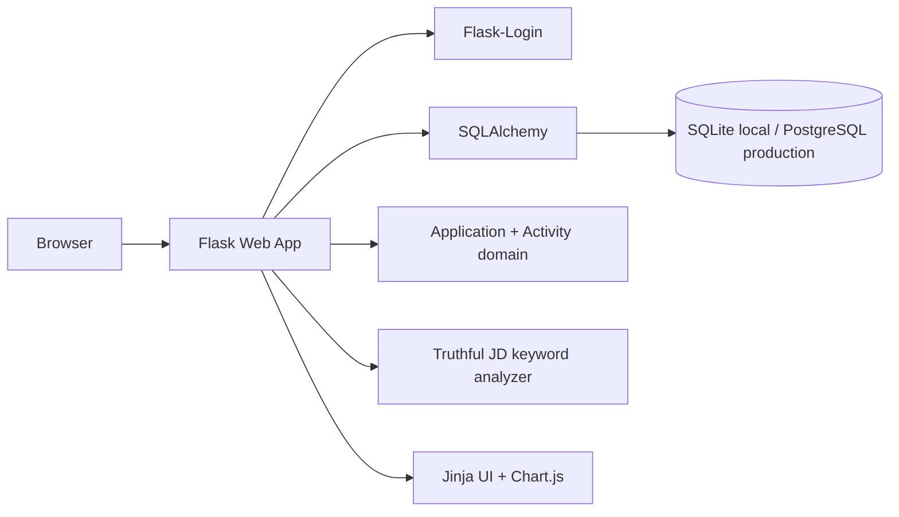

# ApplyFlow

A working job-application CRM and analytics portfolio application. ApplyFlow turns a job search into a measurable pipeline: applications, stages, follow-ups, recruiter interactions, resume versions and role-specific technical matching.

## Implemented in v0.1
- Registration/login with hashed passwords and protected routes
- User-isolated persistent application and activity data
- Full application CRUD with company, role, URL, salary, location, work arrangement, employment type, dates, source, recruiter, status, priority, notes, skills, next action, follow-up, resume and cover-letter metadata
- Table search/filtering and a 9-stage Kanban pipeline
- Application detail page with status changes and activity timeline
- Dashboard metrics: total, month, interviews, offers, response rate and interview conversion
- Upcoming follow-ups, recent activity, pipeline counts and application-over-time chart
- Truthful local job-description technical keyword analyser (no fabricated qualifications)
- Realistic fictional demo-data loader
- Responsive SaaS UI, Dockerfile, PostgreSQL-compatible configuration and GitHub Actions test workflow

## Architecture


## Data model
`User 1 -> many Application`

`Application 1 -> many Activity`

Every application/activity query is scoped to the authenticated user. Production hardening should add CSRF protection, stronger validation, migrations and rate limiting.

## Run locally
```bash
python -m venv .venv
# Windows
.venv\Scripts\activate
# macOS/Linux
source .venv/bin/activate
pip install -r requirements.txt
python app.py
```
Open `http://127.0.0.1:5000`, register, and choose **Load demo data**.

## Test
```bash
pytest
```

## Environment
Copy `.env.example` values into your deployment environment. Never commit production secrets. The app defaults to SQLite locally; set `DATABASE_URL` to PostgreSQL for production.

## Security considerations
Passwords use Werkzeug hashing; private routes require authentication; application queries enforce user ownership. Before a public launch add CSRF tokens, email verification/password reset, stricter URL/email validation, security headers, rate limiting, database migrations and production secret management.

## Portfolio project summary
ApplyFlow is a full-stack job-search CRM designed to help candidates manage applications as a structured sales-style pipeline. It persists application records and activity history, supports table and Kanban workflows, schedules follow-ups, calculates conversion metrics, visualises application activity and performs truthful technical-keyword matching against job descriptions. The project demonstrates authentication, relational modelling, authorization, CRUD workflows, search/filtering, analytics, responsive UI design, business logic, testing and deployment configuration.

## Resume bullets
- Developed a full-stack job-application CRM with authenticated, user-isolated application records, activity timelines, follow-up scheduling and multi-stage pipeline management.
- Implemented searchable table and Kanban workflows plus analytics for application volume, response rate, interview conversion and pipeline status.
- Designed relational SQLAlchemy models and authorization rules for users, applications and interaction history, with PostgreSQL-compatible production configuration.
- Built a truthful job-description technical matching feature and packaged the application with automated tests, Docker and CI configuration.

## Interview preparation
1. **How is user data isolated?** Understand `own_app`, authenticated query filters and why an ID alone must never grant access.
2. **Why separate Activity from Application?** Understand one-to-many modelling and immutable-ish timeline records.
3. **How are conversion rates calculated?** Understand which statuses count as responses/interviews and the assumptions behind the metric.
4. **Why SQL rather than a document database?** Be able to discuss relational integrity, querying and future entities such as contacts/documents/tasks.
5. **How would you migrate SQLite to PostgreSQL?** Understand `DATABASE_URL`, migrations and production connection handling.
6. **What is missing from the current security model?** Explain CSRF, rate limiting, verification/reset, headers and validation.
7. **How would real AI analysis be added safely?** Discuss server-side API calls, prompt/data minimisation, structured outputs and preventing fabricated experience.
8. **How would document uploads work?** Discuss object storage, signed URLs, metadata, malware/file validation and access control.
9. **How would you test the pipeline?** Discuss unit tests for metrics plus integration tests for ownership, CRUD and status transitions.
10. **How would you scale it?** Discuss stateless app servers, managed PostgreSQL, caching only where useful, background jobs and observability.

## Commercial direction
**Target customer:** active job seekers, graduates and professionals managing many applications.

**Problem:** spreadsheets and notes make follow-ups, application history and conversion patterns difficult to manage.

**Potential model to validate:** useful free CRM; paid tier around AI analysis, document/version management, email/calendar integrations, advanced analytics and automated reminders. A plausible experiment might test a low monthly consumer price, but pricing should not be treated as validated until real users demonstrate willingness to pay.

**Acquisition experiments:** graduate/job-seeker communities, career-content SEO, university clubs/career centres, LinkedIn content and a free application tracker. Competitors include spreadsheets, Notion templates and dedicated job trackers. Differentiation would need validation; likely candidates are strong analytics, trustworthy AI assistance and a cleaner end-to-end workflow.

## Next production iterations
- Alembic/Flask-Migrate migrations
- CSRF + stronger server-side validation
- Password reset and email verification
- Real task entity and reminders
- Resume/cover-letter object storage
- Contact/recruiter entity
- CSV import/export
- Server-side OpenAI integration for structured JD analysis and interview questions
- Calendar/email integrations
- REST API layer
- More comprehensive integration/security tests
- Observability and production deployment

## Known limitations
v0.1 intentionally avoids pretending external AI, email, calendar, file storage or payment integrations exist. The JD analyser is deterministic/local. This makes the current functionality demonstrable while leaving clear production iterations.
