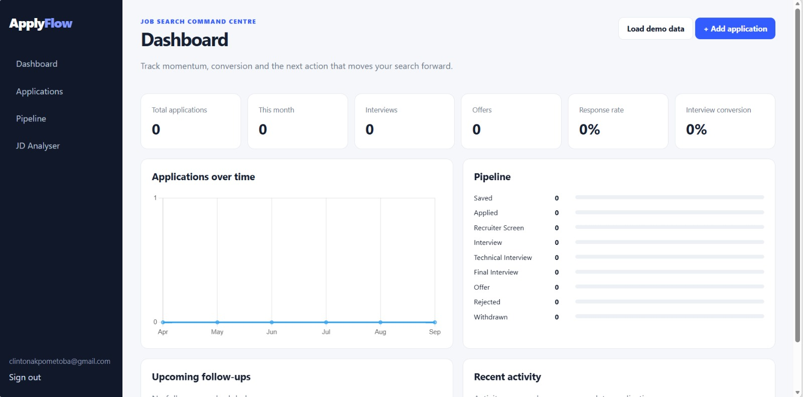

# ApplyFlow

**Job Application CRM & Analytics Platform**

ApplyFlow is a full-stack job-search management platform designed to turn a scattered application process into a structured, measurable pipeline.

It centralises applications, interview stages, recruiter interactions, follow-ups, resume versions and job-specific technical requirements while providing analytics on application performance.

## Dashboard Preview

## The Problem

Job seekers often manage applications across job boards, emails, spreadsheets and personal notes. As application volume increases, it becomes difficult to track:

- which roles require follow-up
- where each application sits in the hiring process
- which resume was submitted
- recruiter interactions
- upcoming interviews and actions
- application and interview conversion rates

ApplyFlow brings that information into one structured workflow.

## Core Features